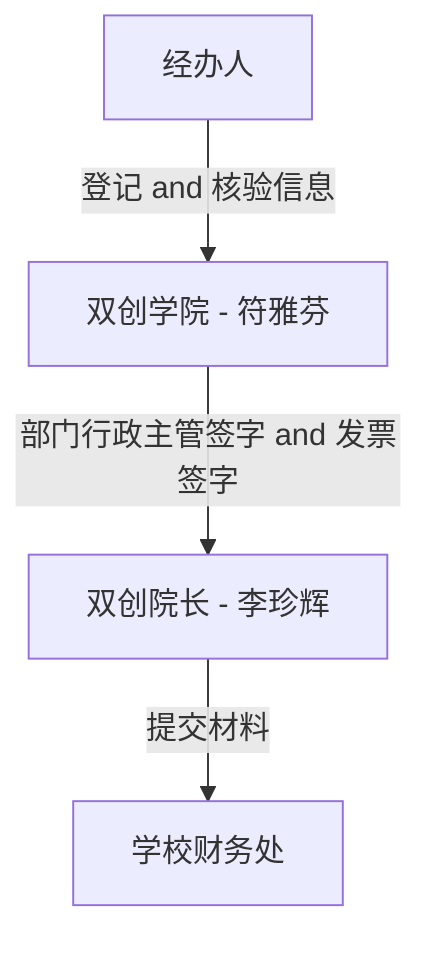

# 费用报销 SOP

资料下载地址：https://cwc.hnie.edu.cn/zlxz.htm

> 或者 Google 搜 `湖南工程学院报账审批单`

## 办理步骤

## 差旅费
需要材料
| 项目 | 必选 | 备注 |
|--|--|--|
|车票|是|--|
|住宿费|--|--|
|差旅费报销单|是|--|
|出差审批单|是|--|
|票据粘贴单|是|--|
|通知函|是|如果是开会，需要会议邀请函。 如果是比赛，需要比赛参加通知函。|

- [湖南工程学院差旅费报销单](https://cwc.hnie.edu.cn/info/1154/1645.htm)
- [湖南工程学院出差审批单](https://cwc.hnie.edu.cn/info/1154/1646.htm)
- [A4版-湖南工程学院票据粘贴单电子模版](https://cwc.hnie.edu.cn/info/1154/1649.htm)

## 发票报销
需要材料
| 项目 | 必选 | 备注 |
|--|--|--|
|发票|是|--|
|订单流水证明|是|交易平台的截图|
|报账审批单|是|--|

- [A4版-湖南工程学院报账审批单](https://cwc.hnie.edu.cn/info/1154/1644.htm)

左下角的 `事项说明` 要填写报销的项目，比如 `09010001 大学生创新创业训练计划`（在比赛指导老师的 OA 里面可以查到）

每张发票都需要 `证明人` 和 `经办人` 在发票 `背面` 签字确认

> `经办人` 是填单子、交发票的那个人
>
> `证明人` 是实验室老师

## 其他事项
- 填报单位
  - 如果是大创项目或者什么比赛项目，填报单位都填写 `创新创业学院`
- 收款账户
  - 开户行、姓名、卡号都用 `铅笔` 写单子右上角
